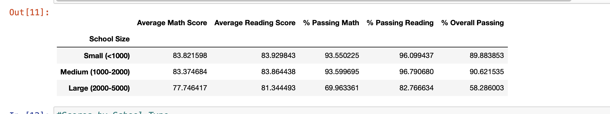

# School Analysis

## Scope
This project compared the budgets of multiple schools with in a city to see how they performed. It look at the type of school it is, public, private, charter to see if there was any correlation there. The overall performance of a school was based on its math and reading scores. 

## Technologies Used
Pandas - used in clean the data and make dataframes for analysis

Jupyter Notebook - used to run the code

## Findings

According the analysis of the data schools with a higher budget did not have higher student performance. Like wise schools with a larger student body also had poorer perfomacne comapred to smaller schools. This can be explained by larger schools likely having a higher student to teacher ratio. 

Another finding was the regardless of school students tended to have better reading grades than math grades. This shows oppurtunity for growth in all schools.